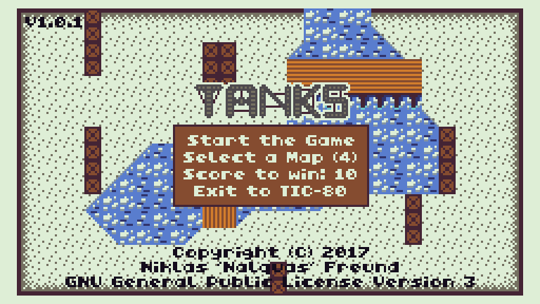

# Tanks
Tanks is a 2 player PvP arcade game, made for the [TIC-80 fantasy console](https://tic80.com/).

Inspired by ["Combat" (Atari 2600)](https://en.wikipedia.org/wiki/Combat_(Atari_2600)#Tank_game).

## Getting the game
You have the following options:

- Get it from [itch.io](https://nalquas.itch.io/tanks)
- Get it from [tic80.com](https://tic80.com/play?cart=192)
- Get it from [GitHub](https://github.com/nalquas/tanks/releases)

## How to play
Both players control a tank. The tanks can drive, turn (in 8 directions) and shoot.
The goal is to destroy the opponent's tank over and over again, until one of the two players wins.

## Controls
The controls have to be assigned **manually** when first starting the game, assuming you didn't already configure your TIC-80 input mapping. (ESC -> Options -> Setup Gamepad)

Both players use their directional keys for movement and their primary button for shooting. Player 1 controls the menu.

## How to use development version
If you **don't** have TIC-80 Pro, please download the `.tic` cartridge in the GitHub release tab instead. The normal TIC-80 build can't open `.lua` formatted development cartridges. Alternatively, you should also be able to use a self-compiled version of TIC-80.

Assuming you have TIC-80 Pro installed, you can install the `.lua` dev cartridge like this:

- Run TIC-80 Pro
- Type `folder` to open your TIC-80 directory
- Copy `tanks.lua` into the folder
- Type `load tanks.lua`, then `run`
